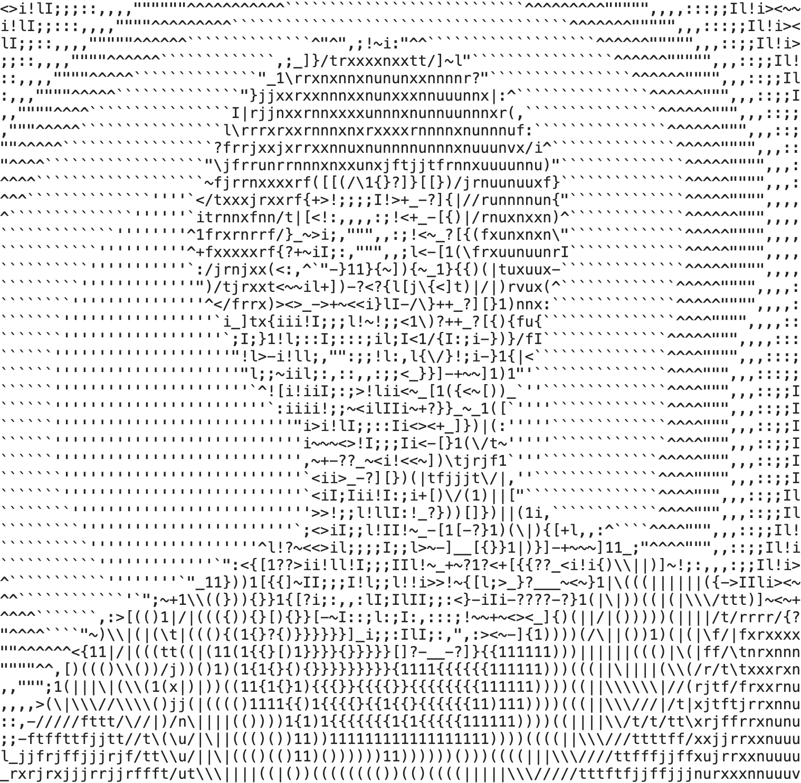

<h1 align="center">Hello! I'm Lenny 🌋</h1>

  <i>Fullstack Engineer, building AI products & scalable backends</i>

  

---

## What I build

I build products that are meant to work, not just demos.

- AI SaaS MVPs (idea → production)
- Reliable AI systems (structured outputs, validation)
- Scalable backend APIs (clean architecture, real constraints)

---

## Featured project

### MonAmiChef 🍳

AI cooking assistant designed for **predictable and usable outputs**.

- structured responses (no random AI output)
- backend validation layer
- mobile + API architecture
- built with real-world constraints

⚙️ less guessing, more control

---

## Approach

AI is powerful but unreliable systems break fast.

I focus on:

- controlling outputs 🧩
- building maintainable systems 🏗️
- shipping fast without sacrificing quality ⚡

---

## Stack

  TypeScript · NestJS · React · React Native · PostgreSQL · Docker

---

## Status

Currently:

- open to Fullstack / Backend roles 👀
- interested in AI-focused teams
- building products on the side

---

## Contact

  <a href="https://www.linkedin.com/in/lenny-garnier-2ab689199/">LinkedIn</a> ·
  <a href="https://lennygarnier.com">Portfolio</a>

